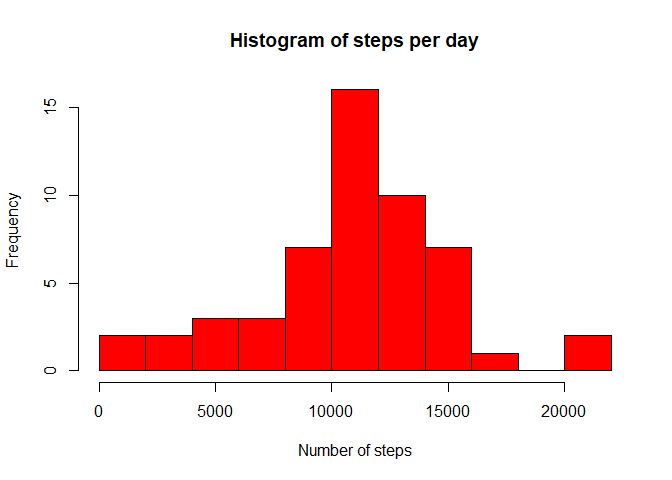
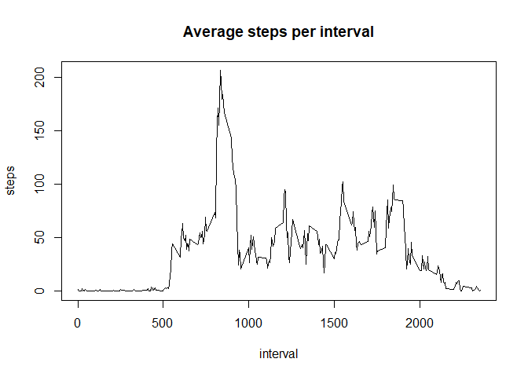
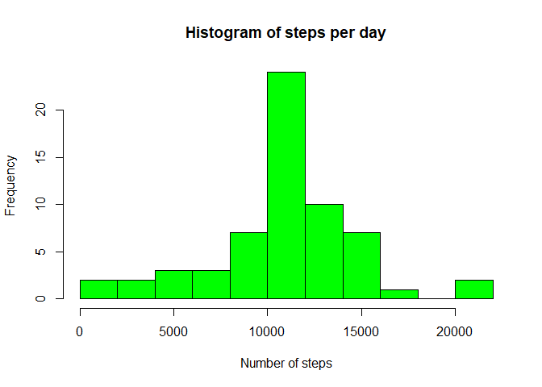
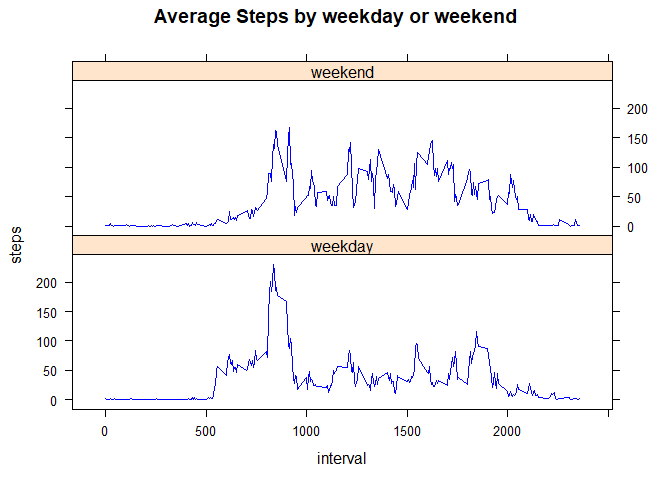

## Loading and preprocessing the data

We start by loading the necessary libraries and the activity data. Then the date 
variable is transformed to the date format for further use.


```r
## Set options
options(scipen = 1, digits = 2)

## Load necessary libraries
library(plyr)
library(dplyr)
```

```
## 
## Attaching package: 'dplyr'
```

```
## The following objects are masked from 'package:plyr':
## 
##     arrange, count, desc, failwith, id, mutate, rename, summarise,
##     summarize
```

```
## The following objects are masked from 'package:stats':
## 
##     filter, lag
```

```
## The following objects are masked from 'package:base':
## 
##     intersect, setdiff, setequal, union
```

```r
library(lattice)

## Loading and preprocessing data
activity<-read.csv("activity.csv",header=TRUE)
activity$date<-as.Date(activity$date)
```

## What is mean total number of steps taken per day?

To determine the mean total number of steps taken per day, we first calculate 
the total number of steps per day


```r
Steps_per_day <- aggregate(steps ~ date, activity, sum)
```

Then a histogram is created to look at the  of the total number of steps taken 
each day


```r
hist(Steps_per_day$steps, col="red", breaks= 10, xlab="Number of steps",
     main = "Histogram of steps per day")
```

<!-- -->

Now the mean and the median of the number of steps are determined:


```r
Daily_mean    <- mean(Steps_per_day$steps)
Daily_median  <- median(Steps_per_day$steps)
```

The result of the code is that the mean steps per day is 10766.19 and the 
median is 10765.

## What is the average daily activity pattern?

To find out what the average number of steps per 5-minute interval is we use the
following R code. The results are shown in a time series plot


```r
## Calculate average number of steps per 5-minute interval
Avg_per_int  <- aggregate(steps ~ interval, activity, mean)

## Create Time series plot
plot(Avg_per_int$interval,Avg_per_int$steps,type="l",ylab="steps", 
     xlab="interval", main="Average steps per interval")
```

<!-- -->

Next we want to know which 5-minute interval, on average across all the days in 
the dataset, contains the maximum number of steps?


```r
filter(Avg_per_int,steps==max(steps))[1,1]
```

```
## [1] 835
```

This means that the interval between 8:35 and 8:40 contains the maximum number 
of steps

## Imputing missing values

First we calculate the total number of missing values in the dataset


```r
missing<-sum(is.na(activity$steps))
```

This gives us that there are 2304 missing values in the dataset

Secondly we fill all of the missing values with the mean of the number of steps 
of the corresponding 5-minute interval. For this a new dataset is created.


```r
impute           <- function(x) replace(x,is.na(x),mean(x,na.rm=TRUE))
activityImputed  <- ddply(activity,~interval,transform,steps=impute(steps))
```

Now we will create another histogram with the total number of steps per day 
using the newly created data


```r
##Calculate number of steps per day of imputed dataset
Steps_per_day_imp <-aggregate(steps ~ date, activityImputed, sum)

## Create a histogram
hist(Steps_per_day_imp$steps, col="green", breaks= 10, xlab="Number of steps",
     main = "Histogram of steps per day")
```

<!-- -->

Then we calculate the new mean and median and also calculate the difference with
the original values.


```r
Daily_mean_imp    <-mean(Steps_per_day_imp$steps)
Daily_median_imp  <-median(Steps_per_day_imp$steps)

Mean_diff   <- Daily_mean_imp   - Daily_mean    
Median_diff <- Daily_median_imp - Daily_median 
```

The result of the code is that the  new mean is 10766.19 and the new 
median is 10766.19. This means that the difference for the means is 
 0 and for the median 1.19.

## Are there differences in activity patterns between weekdays and weekends?

To find out if there is any difference between the activity pattern between 
weekdays and weekends, we need to create a variable that distinguishes between 
the two. For the code to work we need to set locale to English.


```r
Sys.setlocale("LC_TIME", "English")
```

```
## [1] "English_United States.1252"
```

```r
activityImputed$weekends <- ifelse(weekdays(activityImputed$date) 
                                %in% c("Saturday","Sunday"),"weekend","weekday")
```

Now we calculate the avreage number of steps per time interval for the weekdays 
and weekends. The results are shown in a time series plot.


```r
##Average daily activity pattern weekdays versus weekends per 5-minute interval
Avg_per_int <- aggregate(steps ~ interval+weekends, activityImputed, mean)

## Create a time series plot
xyplot(steps~interval|weekends,data=Avg_per_int, type="l",layout=c(1,2), 
       main = "Average Steps by weekday or weekend", col = "blue")
```

<!-- -->

Conclusion:
During weekdays there is more activity in the morning, but in the weekends there
is more activity throughout the day.
